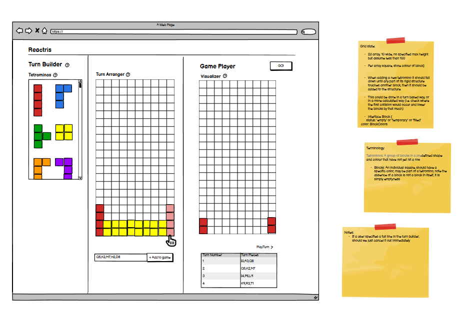

# React Tetris Engine

# Demo

- 

# How Do I Run This

- npm install
- npm run dev
- open a browser and navigate to http://localhost:5173/

- See the gif above for how to use it

# Functionality

- React Tetris Engine
- Features a turn builder with two modes:
  - 'Text Turn Builder' allows a user to enter a turn manually by typing out the text, this also includes basic validation
  - 'Visual Turn Builder' which allows users to build a turn much faster than
- Features a visualizer to be able to inspect the result of any of the turns which have been played
- Allows a user to 'Reset' turns list

# Design Process

- I used Balsamiq to put together a basic wireframe of the application, while I deviated from this slightly during development, the end result is all of the same functionality that I set out to build

# If I had more time / Future Improvements

- There are a vast number of changes that need to be made before this is production ready, a subset of which are below;
  - Known issues:
    - The 'Text Input' does not clear after submission
    - The 'visual builder' can allow a user to submit a block that is outside of the bounds
  - Lack of thorough unit testing, each of the documented example cases from the spec were ran but I did not have time to add these as automated tests
    - If more time were available, it.each test cases for each common / edge scenario of the 'utils.ts' file should be added
  - Lack of E2E testing
    - While the tests above would cover utils, I would also like to use Playwright / Cypress to add some happy path E2E tests
  - Performance concerns; At the moment the application is not optimized for performance and has a larger number of renders than necessary, especally due to the mouseOver events triggered from the visual block builder, which should either be changed to add a throttle or switched to an entry / exit only trigger
  - Poor UX; I was planning to add tooltips or a user guide to explain how to use the application but did not have capacity to add this in
  - The site is not responsive

# Reflecting on this task

- Overall I am happy with the functionality offered by the application I built, but quite disatisfied with the overall code quality

# Concepts

- Block: A single square, can be filled or empty, if filled it will have a specific color
- Tetronimo: A grouping of 4 blocks with a distinct shape and specific colour
- Grid: A group of blocks in a rectangular arrangement, stored in a 2d array
- Turn: A representation of a set of blocks that are dropped, equal to one line in the input file
